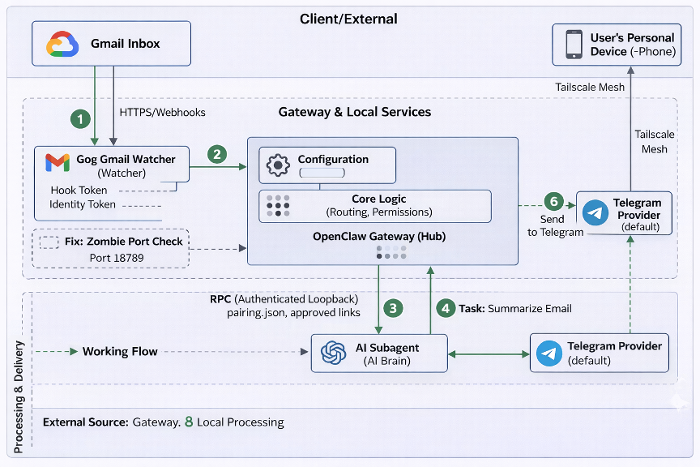
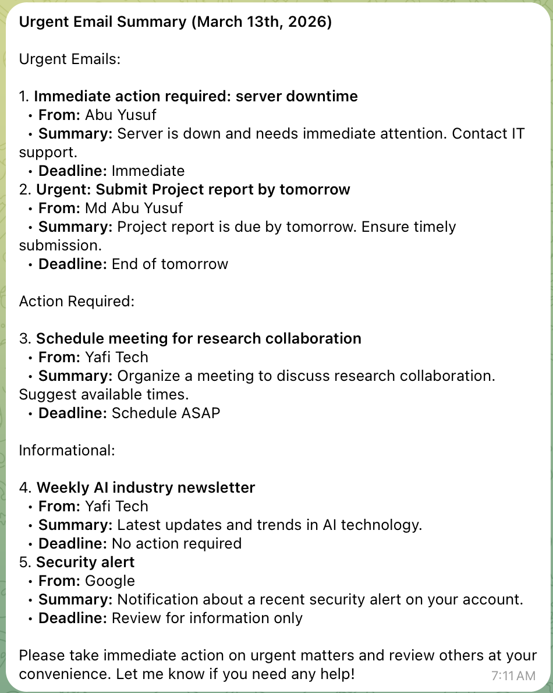

# 🦞 Morning Brief Autonomous AI Assistant

A clean-slate, native installation guide for deploying the **Morning
Brief Autonomous AI Assistant** (powered by OpenClaw) as a macOS
background service.

This setup skips Docker complexity to give the agent direct,
high-performance access to your local system, calendar, and files ---
controlled entirely via Telegram.

------------------------------------------------------------------------
# 🧠 System Architecture Overview

<p align="center">
  
</p>

------------------------------------------------------------------------

# 📋 Prerequisites

## 1️⃣ Install Homebrew

``` bash
/bin/bash -c "$(curl -fsSL https://raw.githubusercontent.com/Homebrew/install/HEAD/install.sh)"
```

------------------------------------------------------------------------

## 2️⃣ Install Node.js 22+

``` bash
brew install node@22
brew link --overwrite node@22
```

Verify:

``` bash
node -v
```

Must be v22.0.0 or higher.

------------------------------------------------------------------------

# 🚀 Installation

## 1️⃣ Deep Clean (Recommended)

``` bash
docker compose down -v 2>/dev/null
rm -rf ~/.openclaw
```

------------------------------------------------------------------------

## 2️⃣ Global Assistant Install

``` bash
npm install -g @openclaw/cli@latest --unsafe-perm
```

------------------------------------------------------------------------

## 3️⃣ Configure PATH

``` bash
echo 'export PATH="$(npm prefix -g)/bin:$PATH"' >> ~/.zshrc
source ~/.zshrc
```

Verify installation:

``` bash
openclaw --help
```

------------------------------------------------------------------------

# 🐣 The Onboarding ("Hatching")

``` bash
openclaw onboard --install-daemon
```

### Recommended Selections

-   Risk Acknowledgement → Yes\
-   Configure Skills → Yes\
-   Missing Dependencies → Install\
-   Enable Hooks → Skip for now\
-   Hatching Method → Open the Web UI

------------------------------------------------------------------------

# 📱 Telegram Integration

## 1️⃣ Create a Telegram Bot

-   Message @BotFather
-   Run `/newbot`
-   Copy the API token

------------------------------------------------------------------------

## 2️⃣ Link the Bot Token

``` bash
openclaw config set channels.telegram.botToken "YOUR_API_TOKEN"
openclaw gateway restart
```

------------------------------------------------------------------------

## 3️⃣ Pair Your Telegram Account

-   Send `/start` to your bot
-   Note the 8-character pairing code

``` bash
openclaw pairing approve telegram YOUR_CODE
```

------------------------------------------------------------------------

# Urgent Email Summary

1. Install google cloud SDK. Run the following commands to install the SDK and authenticate your account:
``` bash
curl https://sdk.cloud.google.com | bash
source ~/.zshrc
gcloud auth login
```

2. Project Initialization & API Setup

```
# Set the active project
gcloud config set project [PROJECT_ID]

# Enable Gmail and Pub/Sub APIs
gcloud services enable gmail.googleapis.com pubsub.googleapis.com
```

3. install tailscale and connected to the device. Networking via Tailscale

```
# Install Tailscale (Debian/Ubuntu example)
curl -fsSL https://tailscale.com/install.sh | sh

# Authenticate and connect the device
sudo tailscale up
```

4. OAuth setup in google cloud

Before authenticating, you must create credentials in the Google Cloud Console:

  1. Navigate to APIs & Services > OAuth consent screen and configure it.

  2. Go to Credentials > Create Credentials > OAuth client ID.

  3. Select Desktop App as the application type.

  4. Download the client_secret.json and move it to your application's config directory.


5. Google Authentication (GOG)

Once your credentials are in place, run the authentication flow to grant the application access to your Gmail data:
```
# This will open a browser window for permission
openclaw auth google login --scopes="https://www.googleapis.com/auth/gmail.readonly"
```

6. Webhook Registration
```
openclaw webhooks gmail setup --account your@gmail.com
```
------------------------------------------------------------------------

# 🖥️ Web UI Dashboard Screenshots

Open anytime:

``` bash
openclaw dashboard
```

### Features

-   Gateway Overview
-   Agent Management
-   Direct Chat Intervention

## 📸 Web UI Dashboard Preview

### 🔹 Gateway Overview
<p align="center">
  
</p>

### 🔹 Agent Management
<p align="center">
  
</p>

### 🔹 Direct Chat Intervention
<p align="center">
  
</p>

------------------------------------------------------------------------

## 📸 Telegram Demo Screenshots


<!-- Telegram demo screenshots -->
<p align="center">
  
  
  
</p>

<p align="center">
  
  
  
</p>

<p align="center">
  
</p>


> Tip: If you rename files (recommended), update the paths above (e.g., `01-hello.jpg`, `02-ai-bullets.jpg`, etc.).

------------------------------------------------------------------------

# 🛠️ Management Commands

  Command                    Action
  -------------------------- -----------------
  openclaw dashboard         Opens Web UI
  openclaw gateway status    Check assistant
  openclaw logs -f           View logs
  openclaw gateway stop      Stop service
  openclaw gateway restart   Restart service

------------------------------------------------------------------------

# 🧠 Architecture Overview

-   Native (no Docker)
-   macOS background daemon
-   Telegram-controlled
-   Web-based dashboard
-   Autonomous Morning Brief system

------------------------------------------------------------------------

# ✅ Final Verification

``` bash
openclaw gateway status
```

If running, your assistant is live and ready.


------------------------------------------------------------------------

# ✅ Setup : “Urgent Email Summary” (scan → classify → summarize top 5 → highlight deadlines) and deliver it to Telegram

-  Go to Cron Jobs to the gateway dashboard
-  put the following values in the New Job form :
  * Name: Urgent Email Summary

  * Description: Daily morning scan and summary of unread emails

  * Agent ID: default (unless you have a specific agent for emails)

  * Enabled: [x] (Keep this checked).

  * Schedule: Change "Every" to Cron (if available in that dropdown)

  * Expression: 0 7 * * * . it indicate 7am

  * Wake mode: Keep as Now

  * Payload: Keep as Agent turn

  * Agent Message: Paste your prompt here:

  "Run urgent-email-summary now. Scan recent unread emails (last 24h), classify, summarize top 5, highlight deadlines. Use the exact output format."

  * Delivery: Set to Announce summary (default)

  * Channel: Type telegram

  * To: Paste your chat ID "Telegram chat ID"
  
  Or create cron job from command prompt
  ```
  openclaw cron add \
--name "Urgent Email Summary Test" \
--cron "*/10 * * * *" \
--tz "America/Chicago" \
--session isolated \
--message "Using the 'urgent-email-summary' skill located in workspace/skills/, 
first execute /home/user/.openclaw/workspace/scripts/fetch_recent_gmail.sh. 
Then, process that output according to the SKILL.md rules and send the final summary to the telegram channel." \
--announce \
--channel telegram
--to "[Telegram ID]"
  ```
<p align="center">
  
</p>
  