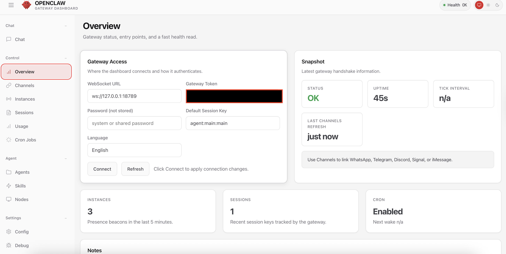
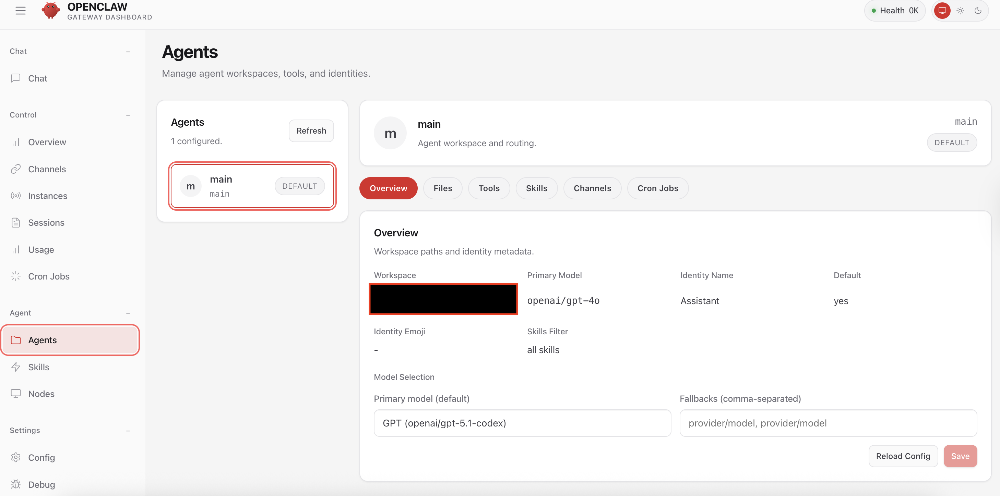
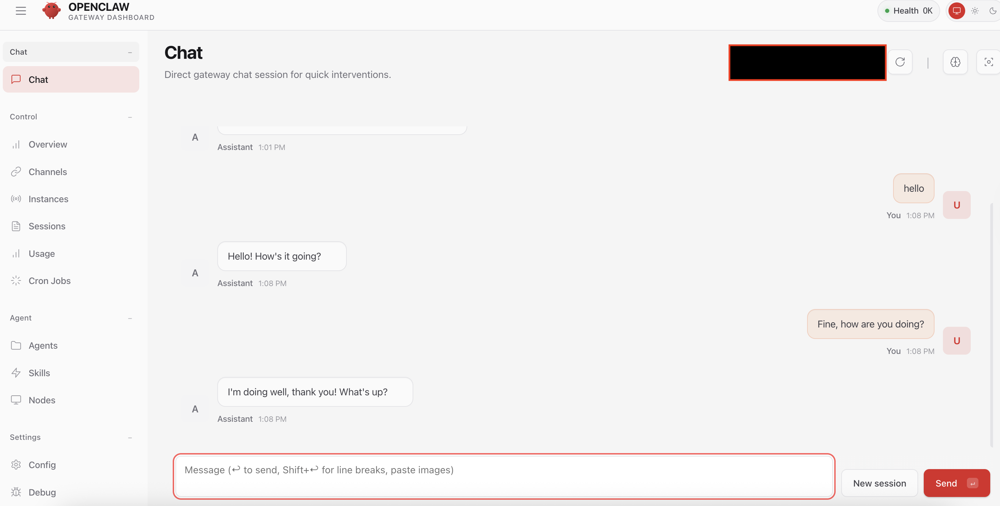
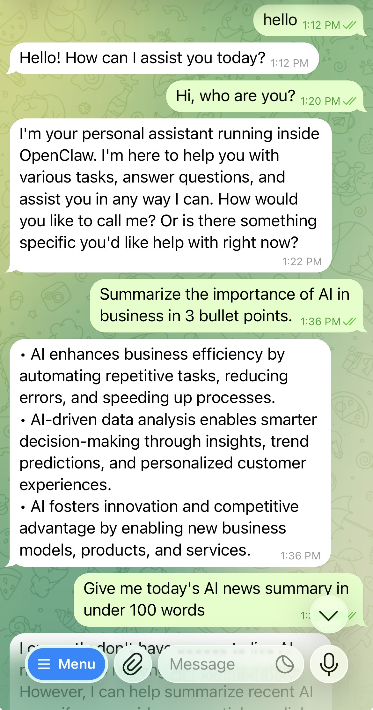
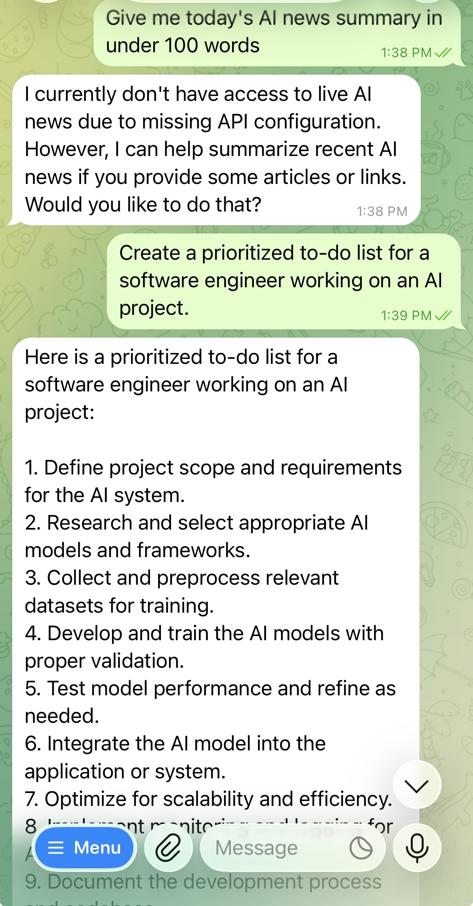
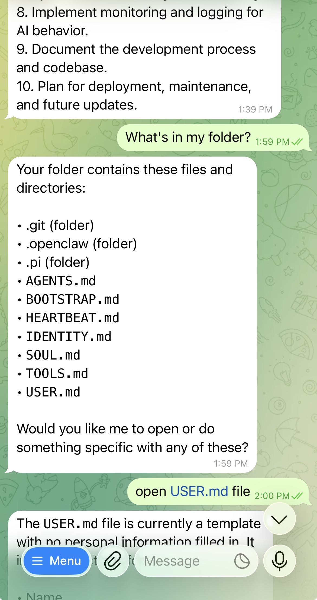
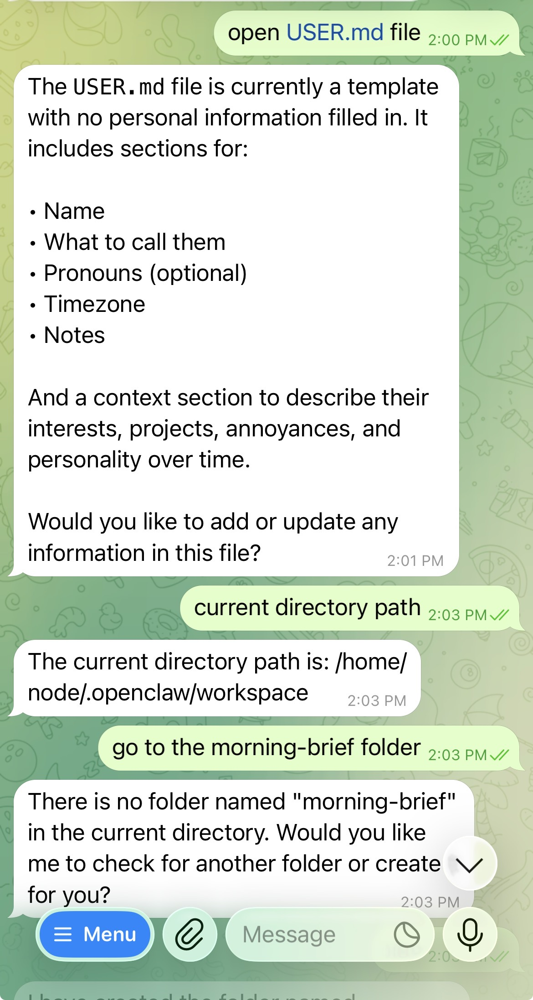
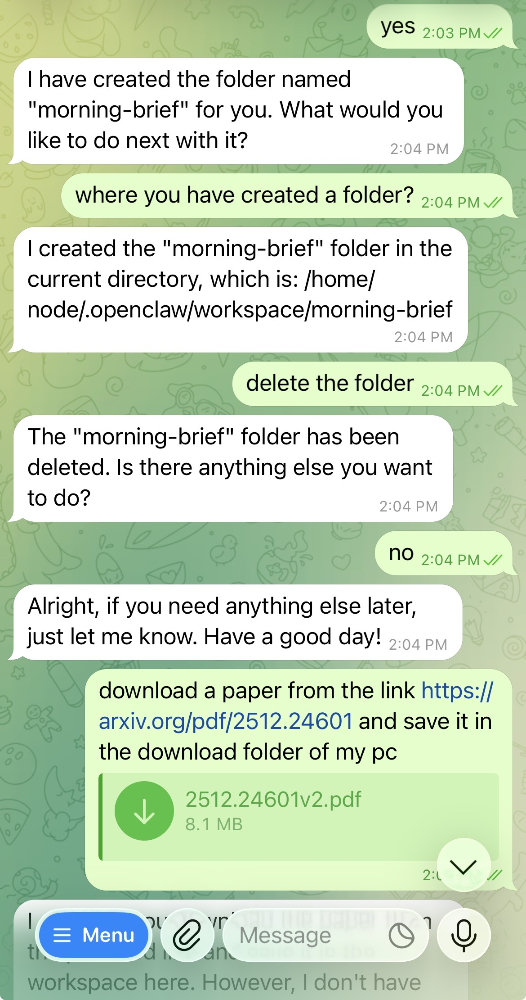
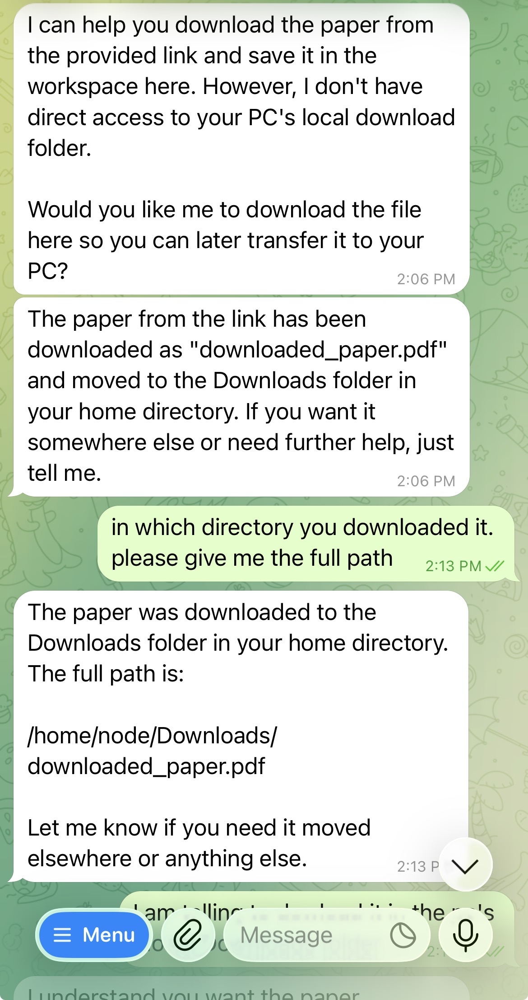
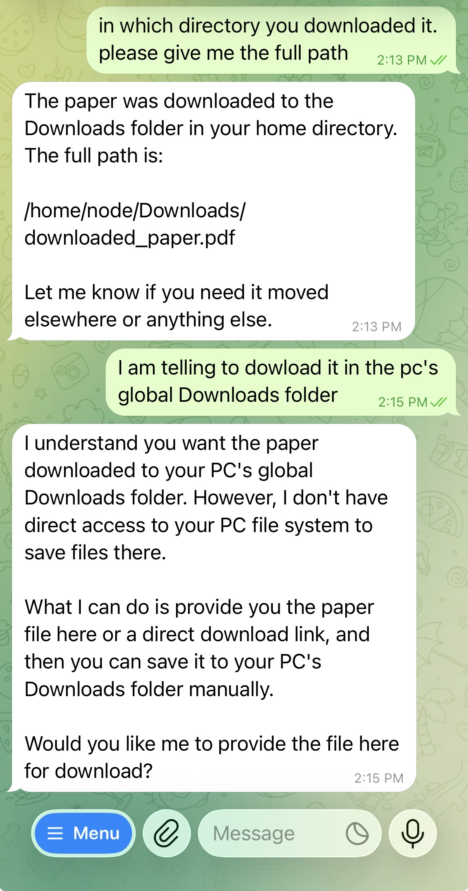

# 🦞 Morning Brief Autonomous AI Assistant

A clean-slate, native installation guide for deploying the **Morning
Brief Autonomous AI Assistant** (powered by OpenClaw) as a macOS
background service.

This setup skips Docker complexity to give the agent direct,
high-performance access to your local system, calendar, and files ---
controlled entirely via Telegram.

------------------------------------------------------------------------

# 📋 Prerequisites

## 1️⃣ Install Homebrew

``` bash
/bin/bash -c "$(curl -fsSL https://raw.githubusercontent.com/Homebrew/install/HEAD/install.sh)"
```

------------------------------------------------------------------------

## 2️⃣ Install Node.js 22+

``` bash
brew install node@22
brew link --overwrite node@22
```

Verify:

``` bash
node -v
```

Must be v22.0.0 or higher.

------------------------------------------------------------------------

# 🚀 Installation

## 1️⃣ Deep Clean (Recommended)

``` bash
docker compose down -v 2>/dev/null
rm -rf ~/.openclaw
```

------------------------------------------------------------------------

## 2️⃣ Global Assistant Install

``` bash
npm install -g @openclaw/cli@latest --unsafe-perm
```

------------------------------------------------------------------------

## 3️⃣ Configure PATH

``` bash
echo 'export PATH="$(npm prefix -g)/bin:$PATH"' >> ~/.zshrc
source ~/.zshrc
```

Verify installation:

``` bash
openclaw --help
```

------------------------------------------------------------------------

# 🐣 The Onboarding ("Hatching")

``` bash
openclaw onboard --install-daemon
```

### Recommended Selections

-   Risk Acknowledgement → Yes\
-   Configure Skills → Yes\
-   Missing Dependencies → Install\
-   Enable Hooks → Skip for now\
-   Hatching Method → Open the Web UI

------------------------------------------------------------------------

# 📱 Telegram Integration

## 1️⃣ Create a Telegram Bot

-   Message @BotFather
-   Run `/newbot`
-   Copy the API token

------------------------------------------------------------------------

## 2️⃣ Link the Bot Token

``` bash
openclaw config set channels.telegram.botToken "YOUR_API_TOKEN"
openclaw gateway restart
```

------------------------------------------------------------------------

## 3️⃣ Pair Your Telegram Account

-   Send `/start` to your bot
-   Note the 8-character pairing code

``` bash
openclaw pairing approve telegram YOUR_CODE
```

------------------------------------------------------------------------

# 🖥️ Web UI Dashboard Screenshots

Open anytime:

``` bash
openclaw dashboard
```

### Features

-   Gateway Overview
-   Agent Management
-   Direct Chat Intervention

## 📸 Web UI Dashboard Preview

### 🔹 Gateway Overview
<p align="center">
  
</p>

### 🔹 Agent Management
<p align="center">
  
</p>

### 🔹 Direct Chat Intervention
<p align="center">
  
</p>

------------------------------------------------------------------------

## 📸 Telegram Demo Screenshots


<!-- Telegram demo screenshots -->
<p align="center">
  
  
  
</p>

<p align="center">
  
  
  
</p>

<p align="center">
  
</p>


> Tip: If you rename files (recommended), update the paths above (e.g., `01-hello.jpg`, `02-ai-bullets.jpg`, etc.).

------------------------------------------------------------------------

# 🛠️ Management Commands

  Command                    Action
  -------------------------- -----------------
  openclaw dashboard         Opens Web UI
  openclaw gateway status    Check assistant
  openclaw logs -f           View logs
  openclaw gateway stop      Stop service
  openclaw gateway restart   Restart service

------------------------------------------------------------------------

# 🧠 Architecture Overview

-   Native (no Docker)
-   macOS background daemon
-   Telegram-controlled
-   Web-based dashboard
-   Autonomous Morning Brief system

------------------------------------------------------------------------

# ✅ Final Verification

``` bash
openclaw gateway status
```

If running, your assistant is live and ready.
